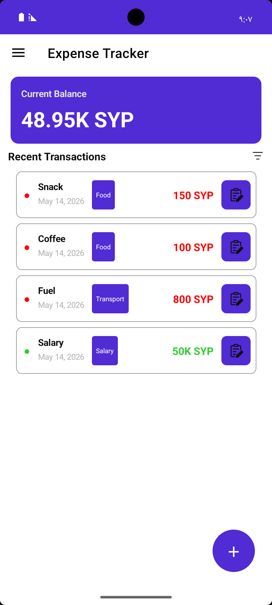
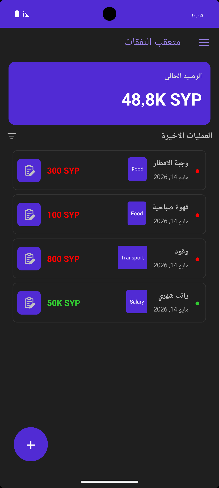
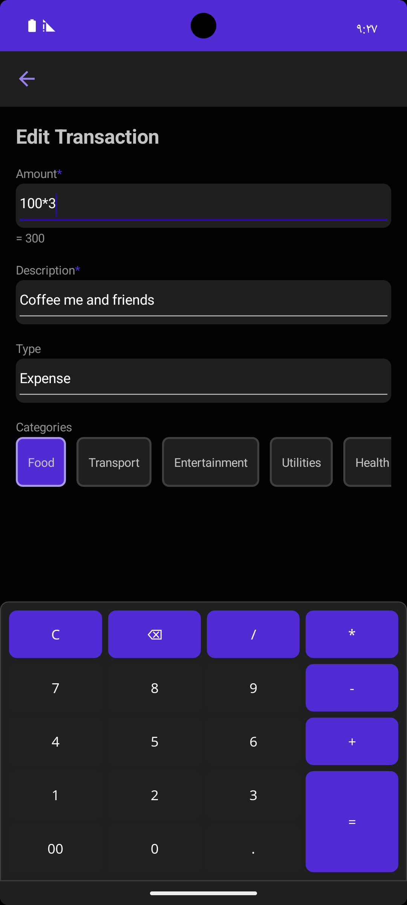
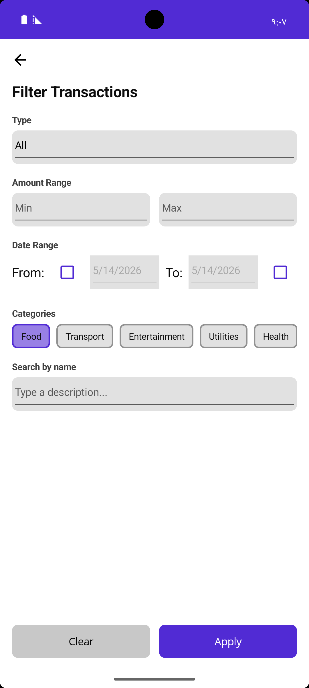
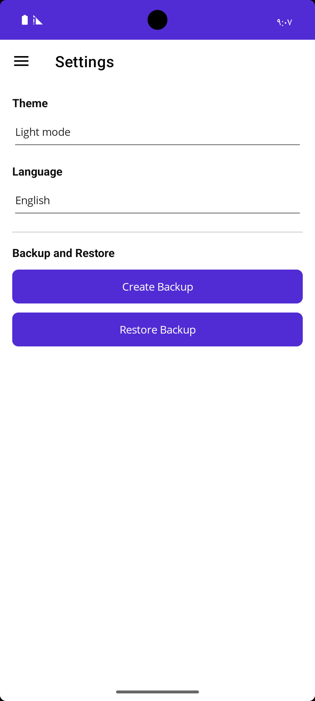

# BudgetFriend

BudgetFriend is a personal expense tracker focused on simple daily finance management across Android devices.

## Overview

BudgetFriend is designed for quick daily expense tracking without unnecessary complexity, allowing users to add new transactions, filter past entries, and manage basic app preferences from a simple mobile and desktop-friendly interface.

## Features

- View your current balance on the main screen
- Browse recent transactions in a clean, card-based list
- Add or edit transactions with:
  - amount entry and live calculation preview
  - description
  - transaction type selection
  - category selection
- Use the transaction filter panel to narrow results by:
  - transaction type
  - amount range
  - date range
  - category
  - transaction name search
- Access app settings for:
  - theme selection
  - language selection
- Create and restore backups from the settings screen
- Localized interface with English and Arabic language support

## Screenshots

## Screenshots

| Main Screen (English / Light Mode) | Main Screen (Arabic / Dark Mode) |
|---|---|
|  |  |

| Transaction Editing | Transaction Filters |
|---|---|
|  |  |

| Settings |
|---|
|  |
## Downloads / Releases

Official builds and release notes are available on GitHub Releases.

## Bug Reports & Feature Requests

Use GitHub Issues for bug reports, feature requests, and general feedback.

## Supported Platforms

- Android

## Closed-Source Notice

This repository is for public product communication only. The source code is private and is not distributed here.
